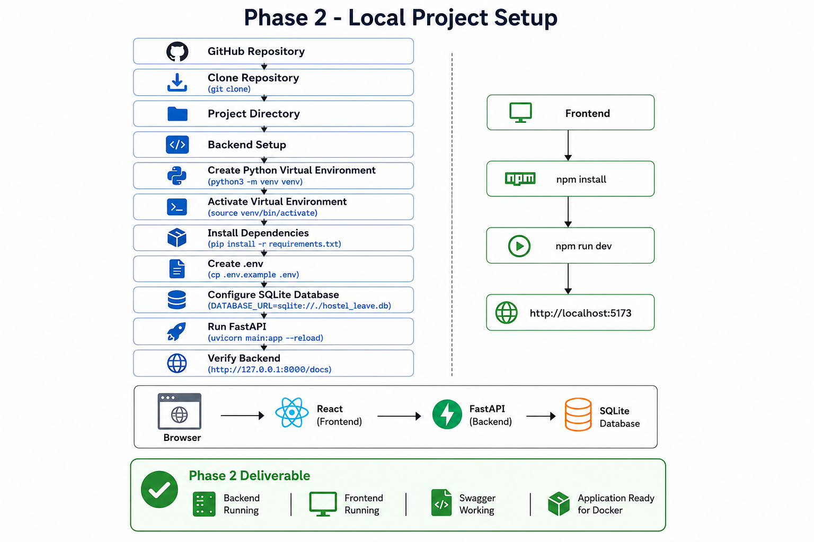

# Phase 2 - Run Hostel Leave Management System Locally

## Goal

Run the complete project on Ubuntu.

At the end of this phase:

- Backend running
- Frontend running
- API working
- Ready for Docker

---

# Project Flow

GitHub
↓
Clone Project
↓
Backend Setup
↓
Python Virtual Environment
↓
Install Packages
↓
Configure .env
↓
Run FastAPI
↓
Verify API (/docs)
↓
Frontend Setup
↓
Run React
↓
Complete Application Running

---

# What We Learned

## Git Clone

Clone downloads the complete project from GitHub.

Why?

- Easy collaboration
- Version control
- Same code for everyone

---

## Virtual Environment (venv)

A separate Python environment for this project.

Why?

- Avoid package conflicts.
- Every project can have its own dependencies.

---

## requirements.txt

Contains all Python packages required by the project.

Example:

- FastAPI
- SQLAlchemy
- Uvicorn
- Twilio

Why?

Instead of installing packages one by one:

pip install -r requirements.txt

installs everything automatically.

---

## Packages

A package is reusable code written by other developers.

Example:

FastAPI → Build APIs

SQLAlchemy → Database operations

Twilio → WhatsApp/SMS

Uvicorn → Run FastAPI server

Pydantic → Validate request data

---

## .env

Stores configuration values and secrets.

Example:

Database URL

SMTP

JWT Secret

Twilio Keys

Why?

Never hardcode passwords inside source code.

---

## .env.example

Template for creating .env.

Every developer creates their own .env.

Actual secrets are never pushed to GitHub.

---

## SQLite

Current project uses SQLite for local development.

Why?

- No installation
- No server
- Easy local testing

Later we will migrate to PostgreSQL using Docker.

---

## Uvicorn

Runs the FastAPI application.

Command:

uvicorn main:app --reload

Why?

Without Uvicorn the application cannot receive HTTP requests.

---

## Swagger UI

URL:

http://127.0.0.1:8000/docs

Why?

- View APIs
- Test APIs
- Verify backend health

---

## Frontend

React + Vite

Runs on:

http://localhost:5173

---

# Architecture

Browser
↓
React
↓
FastAPI
↓
SQLite Database

---

# Common Errors

## ModuleNotFoundError

Example

No module named 'bcrypt'

Cause

Package not installed.

Fix

pip install bcrypt

Update requirements.txt if needed.

---

## Wrong DATABASE_URL

Cause

Project tries to connect to PostgreSQL even though PostgreSQL is not running.

Fix

Use SQLite during local development.

DATABASE_URL=sqlite:///./hostel_leave.db

---

## .env Missing

Cause

Configuration file not created.

Fix

cp .env.example .env

---

## Port Already in Use

Cause

Another application is already using port 8000.

Fix

Stop the running process or use another port.

---

## Frontend Cannot Reach Backend

Cause

Backend not running.

Fix

Start FastAPI before starting React.

---

# Production Notes

Always follow this order.

Clone
↓

Create venv
↓

Activate venv
↓

Install dependencies
↓

Configure .env
↓

Run backend
↓

Verify API
↓

Run frontend

Never skip verification after each step.